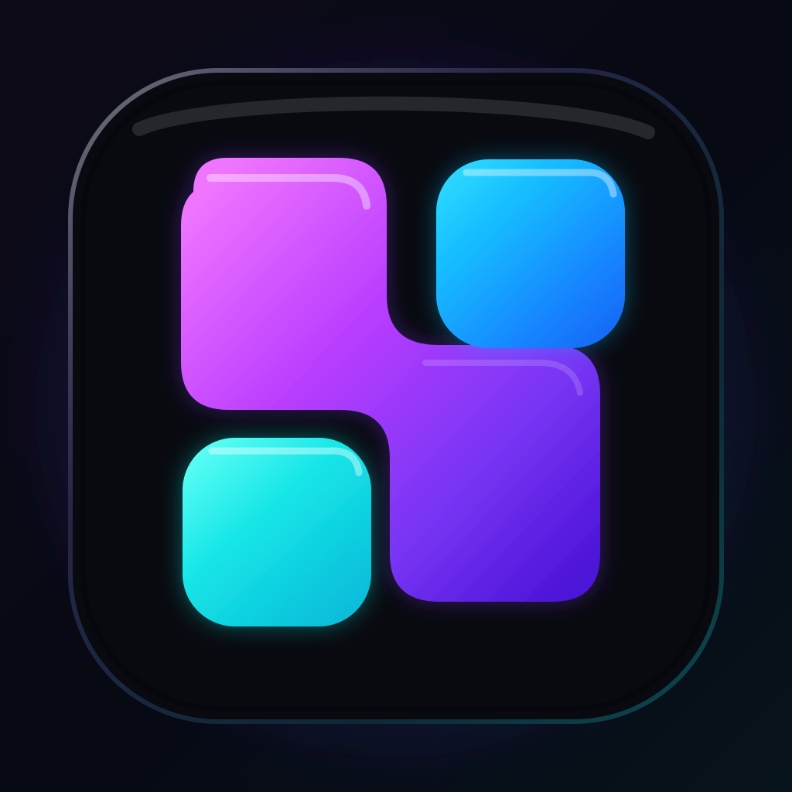

<div align="center">
  

# Natively Lite CN

**Natively 的轻量中文自用分支：中文优先、BYOK、OpenAI-compatible REST STT。**

[](https://github.com/blankanswer/natively-cluely-ai-assistant/actions/workflows/lite-cn-build.yml)
[](https://github.com/blankanswer/natively-cluely-ai-assistant/actions)
[](LICENSE)

</div>

> [!IMPORTANT]
> 这是基于 [Natively](https://github.com/Natively-AI-assistant/natively-cluely-ai-assistant) 的个人轻量化分支，不是上游官方发行版。上游版权、署名和许可条款保持不变，使用前请阅读本仓库的 [LICENSE](LICENSE)。

## 这个分支做了什么

Natively Lite CN 的目标不是完整复制上游的全部云端、Premium 和本地模型能力，而是保留日常使用需要的桌面端核心路径，并尽量减少配置和打包负担。

- 中文优先的首次使用体验与 AI/STT 默认设置
- OpenAI-compatible `/audio/transcriptions` REST STT
- 支持自定义 API Base URL / 完整 transcription endpoint
- 支持自定义 transcription model
- BYOK API Key，继续使用 Electron 侧的加密凭据存储
- 保留原生麦克风 / 系统音频采集能力
- Lite renderer 与 Lite Electron main-process 构建路径
- 不依赖私有 Premium submodule 作为 Lite 入口
- 不打包本地 ASR 模型资源
- Windows 与 macOS GitHub Actions 构建

## 当前状态

当前主要目标是先把 **Lite CN 的可重复构建与自用安装包** 做稳定。

| 项目 | 状态 |
| --- | --- |
| Windows x64 CI | ✅ |
| macOS Apple Silicon CI | ✅ |
| Lite renderer / Electron build | ✅ |
| Native audio module | ✅ |
| Developer ID 签名 | 暂不处理 |
| Apple notarization | 暂不处理 |
| 正式 DMG 分发 | 暂不处理 |

CI 产物可在仓库的 **Actions → Lite CN Build** 中下载。

## 构建环境

推荐使用：

- Node.js 22
- npm
- Rust stable
- macOS：Xcode Command Line Tools
- Windows：可用于编译 Node/Rust native addon 的 MSVC Build Tools

安装依赖时，Lite CI 会跳过上游 `postinstall`，再只准备当前构建真正需要的 native dependencies：

```bash
npm ci --ignore-scripts
npx patch-package
npm rebuild sharp
node scripts/build-native.js
node scripts/rebuild-native-electron.js
node scripts/verify-native-arch.js
```

构建 Lite renderer 与 Electron main process：

```bash
node node_modules/typescript7/lib/tsc.js -p tsconfig.json --noEmit
npx vite build --config vite.config.lite.mts
node scripts/build-electron-lite.js
```

打包：

```bash
npx cross-env NATIVELY_LITE_CN=1 CSC_IDENTITY_AUTO_DISCOVERY=false \
  node scripts/package-app.js --config electron-builder.lite.cjs --publish never
```

完整 CI 流程以 [`.github/workflows/lite-cn-build.yml`](.github/workflows/lite-cn-build.yml) 为准。

## macOS 自用说明

当前 macOS 构建没有 Developer ID 签名和 Apple notarization，因此从 GitHub 下载后可能被 Gatekeeper 拦截。

对于**你自己确认来源、自己构建的 App**，可以先尝试在“系统设置 → 隐私与安全性”中选择“仍要打开”。也可以移除该 App 的 quarantine 属性：

```bash
xattr -dr com.apple.quarantine "/Applications/Natively Lite CN.app"
```

这不是正式软件分发方案；以后如果需要给其他用户无障碍安装，再补 Developer ID signing 与 notarization。

## 项目结构

```text
src/                         Renderer / UI
electron/                    Electron main process
native-module/               Rust / N-API 原生音频模块
scripts/build-electron-lite.js
vite.config.lite.mts         Lite renderer 配置
electron-builder.lite.cjs    Lite 打包配置
assets/lite-icon.svg         Lite CN 图标源文件
.github/workflows/lite-cn-build.yml
```

Lite 图标保留 SVG 作为 source of truth；打包前由 `scripts/package-app.js` 使用 `sharp` 自动 rasterize 为 1024×1024 PNG，再交给当前 electron-builder 的平台图标转换流程。

## 与上游的关系

本分支来源于 Natively，并针对个人中文环境做减法和适配。这里不会把自己描述成上游官方产品，也不会沿用与 Lite CN 实际能力不一致的上游营销说明。

如果你需要上游的完整功能、官方发行版或最新产品信息，请访问上游仓库：

- [Natively upstream repository](https://github.com/Natively-AI-assistant/natively-cluely-ai-assistant)

## License

本分支保留上游许可证与版权信息。具体允许的用途、限制和义务以 [LICENSE](LICENSE) 原文为准。
