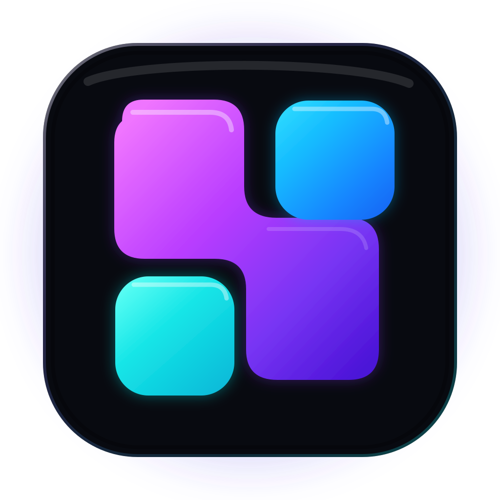

<div align="center">
  

# Sottura

**中文优先、BYOK、低干扰的桌面 AI 助手。**

*Quiet intelligence, always within earshot.*

</div>

> [!IMPORTANT]
> Sottura 是基于 Natively 二次开发的独立、非官方、个人/非商业项目，不代表上游官方发行版。使用前请阅读本仓库的 [LICENSE](LICENSE)。
>
> **This project is based on Natively, originally developed by Natively AI Private Limited.**

## Sottura 是什么

Sottura 保留桌面悬浮助手最常用的核心路径，同时把配置与构建流程收敛到更适合个人使用的形态：中文优先、自带 Key、可接 OpenAI-compatible API，并继续保留原生麦克风与系统音频采集。

当前重点能力：

- 中文优先的首次使用体验与 AI / STT 默认设置
- OpenAI-compatible Chat Completions Assistant
- OpenAI-compatible `/audio/transcriptions` REST STT
- 自定义 API Base URL、模型与 API Key
- API Key 继续通过 Electron 侧凭据存储处理
- 原生麦克风 / 系统音频采集
- 截图与多轮对话上下文
- Windows x64 与 macOS Apple Silicon CI 构建
- 不依赖上游私有 Premium submodule
- 不打包本地 ASR 模型资源

## 当前状态

| 项目 | 状态 |
| --- | --- |
| Windows x64 CI | ✅ |
| macOS Apple Silicon CI | ✅ |
| Renderer / Electron build | ✅ |
| Native audio module | ✅ |
| Developer ID 签名 | 暂不处理 |
| Apple notarization | 暂不处理 |
| 正式 DMG 分发 | 暂不处理 |

当前 CI 产物以自用测试为目标。正式公开分发前仍需要单独处理签名、notarization 与发布流程。

## 构建环境

推荐：

- Node.js 22
- npm
- Rust stable
- macOS：Xcode Command Line Tools
- Windows：可编译 Node/Rust native addon 的 MSVC Build Tools

安装依赖与准备 native dependencies：

```bash
npm ci --ignore-scripts
npx patch-package
npm rebuild sharp
node scripts/build-native.js
node scripts/rebuild-native-electron.js
node scripts/verify-native-arch.js
```

构建 Sottura：

```bash
npm run build:sottura:renderer
npm run build:sottura:electron
npm run package:sottura
```

完整 CI 流程以 [`.github/workflows/lite-cn-build.yml`](.github/workflows/lite-cn-build.yml) 为准。文件名暂时保留 `lite-cn-build.yml` 作为迁移期内部名称；workflow 对外显示为 **Sottura Build**。

## macOS 自用说明

当前 macOS 构建没有 Developer ID 签名和 Apple notarization，因此从 GitHub 下载后可能被 Gatekeeper 拦截。

对于你自己确认来源、自己构建的 App，可以先尝试在“系统设置 → 隐私与安全性”中选择“仍要打开”。也可以仅对这份 App 移除 quarantine 属性：

```bash
xattr -dr com.apple.quarantine "/Applications/Sottura.app"
```

这不是正式软件分发方案；如果未来公开提供无障碍安装，再补 Developer ID signing 与 notarization。

## 项目结构

```text
src/                         Renderer / UI
electron/                    Electron main process
native-module/               Rust / N-API 原生音频模块
scripts/build-electron-lite.js
vite.config.lite.mts         Sottura renderer 构建配置（迁移期文件名）
electron-builder.lite.cjs    Sottura 打包配置（迁移期文件名）
assets/sottura-icon.svg      Sottura 图标源文件
.github/workflows/lite-cn-build.yml
```

Sottura 图标保留 SVG 作为 source of truth；打包前由 `scripts/package-app.js` 使用 `sharp` rasterize 为 1024×1024 PNG，再交给 electron-builder 的平台图标转换流程。

## 与上游的关系

Sottura 保留上游代码来源与 Git 历史，但使用独立项目名称、应用标识和视觉品牌。项目不会把自己描述为 Natively 官方版本。

上游项目：

- [Natively](https://github.com/Natively-AI-assistant/natively-cluely-ai-assistant)

再次明确：**This project is based on Natively, originally developed by Natively AI Private Limited.**

## License

本项目继续遵守并保留上游许可证与版权要求。具体允许用途、限制、署名与再分发义务以 [LICENSE](LICENSE) 原文为准。
